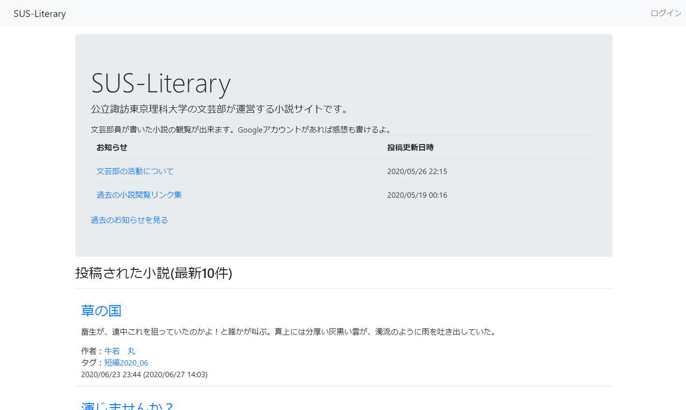
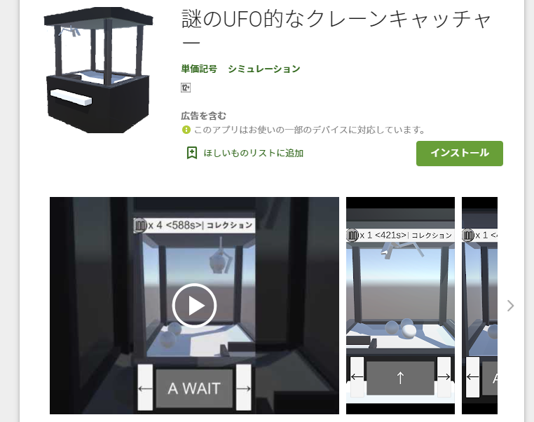
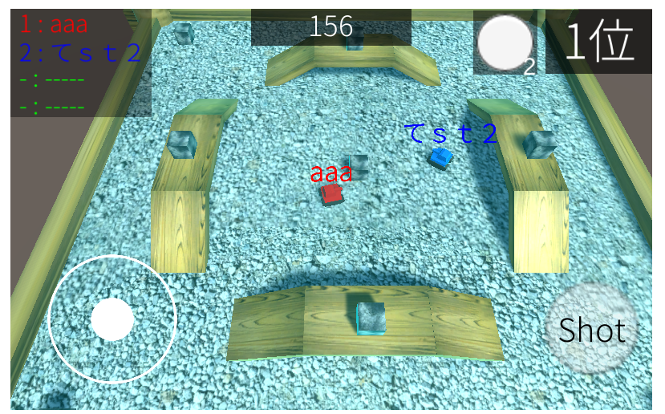

# ポートフォリオサイトの説明
　マークダウンで記述しているが書き方練習中でまだ良く分かっていない。  
　現在工事中であり未完成。
  
  
# 制作した作品
  
## SUS-Literary「文芸部WEBサイト」
   
  
[WEBサイトへのリンク](https://secure-everglades-39963.herokuapp.com/)  
  
　文芸部で執筆した小説を掲載するために制作したWEBサイトです。  
　機能を箇条書きにまとめると  
- 部員が自由に小説を掲載できる（全体公開 / 部員のみ、といった公開範囲の設定が可能  
- 小説に感想が書ける（部員以外でも可能  
- WEBサイトの管理者は部活のお知らせを掲載できる  
- Googleアカウントを使った外部認証でログインが可能  
- ログインしたアカウントは「一般」「部員」「禁止（感想が書けない」に分けれる  
- 分けれるのは管理者のみ  
- 初めてログインしたアカウントは自動的に一般に振り分けられる  
- 小説・お知らせが投稿されると、各アカウントにメールでお知らせが届く  
  
　このWEBサイトは、私が所属している文芸部の問題を解決するために制作しました。その問題とは、執筆した小説が読まれないことです。部活動の一環で執筆した作品を本としてまとめ、大学図書館に寄贈する活動があるのですが、図書館では執筆された作品があまり読まれません。そこで小説を自由に投稿可能なＷＥＢサイトを作ることを決めました。理由はWEB上なら大学図書館よりも、手軽に作品が読めるようになるからです。　
　ただ私はＷＥＢサイト製作するための知識について、まだ一部しか大学で学んでおらず、足りない知識を当時無料開放されていたN予備校を使って補いながら制作しました。  
　このWEBサイトの制作では、Expressを用いました。理由としては趣味で使っていたelectronでのNode.jsを書いた経験が、このWEBサイトでの制作に応用できそうだと考えたからです。また、このサイトを公開するため、Herokuを使いました。  
　WEBサイトのプロトタイプができた際には、友人に改善点を出してもらって完成度を高めました。完成したWEBサイトを部員に使ってもらったところ「使いやすい」と好評をいただき、現在はリモート部活動の場としても活用しています。  
  
  
## 謎のUFO的なクレーンキャッチャー「クレーンキャッチャーを模したAndroid用ゲーム」
   

  
　[このアプリを公開しているGooglePlayへのリンク](https://play.google.com/store/apps/details?id=com.tankakigou.nazoUFO)
   
　Unityで制作したクレーンキャッチャーゲームです。一プレイは５分に一度までの制限をかけ、広告を見ることで5分以内でもプレイできるような仕組みになっています。  
　現在はGooglePlayにて公開しています  
  
  
## NETank「オンライン対戦ができる戦車ゲーム」
   

  
　[このアプリを公開しているUnityRoomへのリンク](https://unityroom.com/games/netank)  
  
　unityで制作した戦車ゲームです。Photonを用いてオンライン対戦をすることが出来ます。  
　現在はUnityRoomにて公開しています。  
